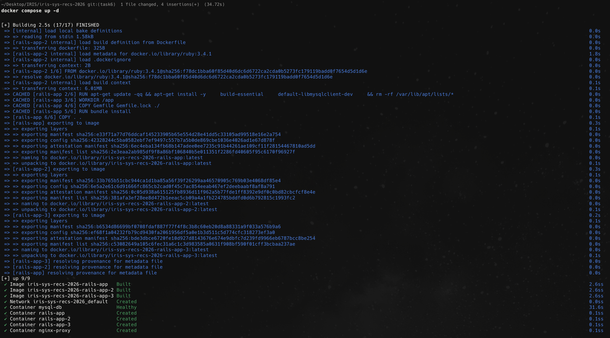
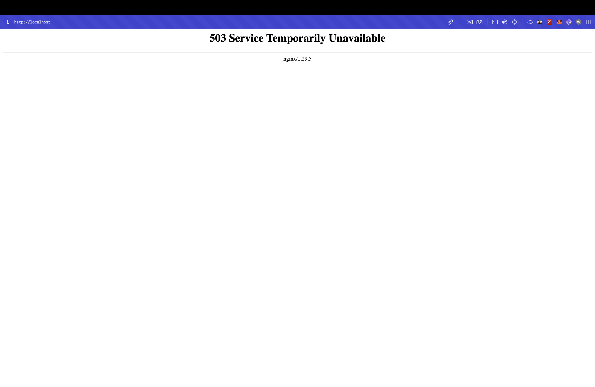

# iris-sys-recs-2026

# Task1

Fixed the error generated due to `activesupport` and `activerecord` version issue. Just commented them so ruby manages them automatically.


# Task2

Changes made in `database.yml`:
* `socket: /var/run/mysqld/mysqld.sock` to `host: mysql-db`
* since the databse is hosted by docker container named `mysql-db` not in the host machine

Create a network `iris-network`

Command to run the sql:

```bash
docker run -d \
  --name mysql-db \
  --platform linux/amd64 \
  --network iris-network \
  -e MYSQL_ROOT_PASSWORD=Gukesh12garry@ \
  mysql:5.7
```


Command to run the app:

Before that had to build again since we changed `database.yaml`.

```bash
docker run -d \
  --name rails-app \
  --network iris-network \
  -p 8080:3000 \
  iris
```

add then migrated the database create database and tables.

```bash
docker exec rails-app bin/rails db:create db:migrate
```


# Task 3

Added the `nginx.conf` file and restarted the app container to not expose the port 8080.

now the app is accessed from the url `localhost` since it proxies it to `rails_app` which set to `rails_app:3000` which is the docker container name of the app.


# Task 4

I ran two more container using this command:

```bash
docker run -d \
  --name rails-app-2 \
  --network iris-network \
  iris

docker run -d \
  --name rails-app-3 \
  --network iris-network \
  iris
```

and then set the upstream in `nginx.conf` to use all three container i.e 

```nginx
        server rails-app:3000;
        server rails-app-2:3000;
        server rails-app-3:3000;
```

since the nginx automatically load balance using Round Robin.

Then restarted the `nginx` container to apply changes.


# Task 5

Create a volume to store the data from the database with the command:

```bash
docker volume create iris-db-data
```

Then created a new container with `-v` flag i.e mount the volume to the container:

The volume is mounted to the folder in the container where my sql stores the date i.e `/var/lib/mysql`.

```bash
docker run -d \
  --name mysql-db \
  --network iris-network \
  -v iris-db-data:/var/lib/mysql \
  -e MYSQL_ROOT_PASSWORD=Gukesh12garry@ \
  -e MYSQL_DATABASE=iris_db \
  --platform linux/amd64 \
  mysql:5.7
```

This makes sure even when container dies the data is present in the volume.

And already the `nginx.conf` is present in the repo and attached via `-v` flag previously, so the presists in the laptop even when container dies,
and mounts back when container starts again.

# Task 6

Added compose file and optimised it for bundle cache.



# Task 7 

Update `nginx.conf` to use rate limit via:

```nginx
limit_req_zone $binary_remote_addr zone=mylimit:10m rate=5r/s;
```

here:
* `$binary_remote_addr`: Identify users by IP address
* `zone=mylimit:10m`: Create a memory zone named "mylimit" (10MB size)
* `rate=5r/s`: Allow 5 requests per second 

now apply the limit via:

```nginx
limit_req zone=mylimit burst=10 nodelay;
```


